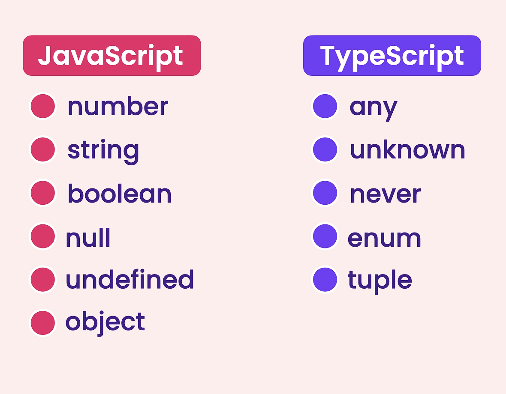

# Benefits

- Static Typing : js is dynamic type language which leave room for bugs.
- Code completion
- Refactoring
- Shorthand notations

`drawback` : there is always one step involved of transpiling the typscript file to the js file , since browswer do not understands the typescript.

`install` : npm i -g typescript

`verify` : tsc -v

`to compile ts file to js` : tsc index.ts

`create configuration file` : tsc --init

`once-configured` : just type tsc all files will be converted to js.

`to enable automatic conversion` : tsc -w

### Debuging Typescript

- Created the launch.json file in vscode.
- `added this line below "program"` : "preLaunchTask": "tsc: build - tsconfig.json",
- Then follow normal debug process like we do in cpp.

# Typescript Types

- Type script will try to infer the type of variable when you declare and initialize at same time.(we can explicity define type as well if we don't want to initialize variable while declearing it.)
- if we declare variable and do not initialize it and also do not tell typescript what type of that variable is then it will take type `any` . see `vars.ts`
